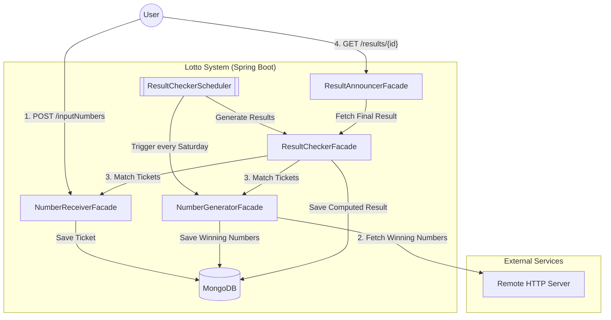

# Lotto Game Service 🎰

A robust, production-ready backend system for a lottery service built with **Java 17** and **Spring Boot 2.7.8**. This project demonstrates Clean Architecture, Domain-Driven Design (DDD) principles, and an advanced automated testing suite.

## 🚀 Key Features

* **Number Receiver:** Accepts user numbers, validates them (6 numbers in range 1-99), and issues a unique Ticket ID.
* **Number Generator:** Fetches winning numbers from an external HTTP server (simulated via WireMock in tests).
* **Result Checker:** Automatically matches user tickets against winning numbers for specific draw dates.
* **Result Announcer:** Provides a clear "win/loss" status based on specific Ticket IDs.
* **Scheduled Draws:** Automated logic for determining the next draw date.

---

## 🏗 Architecture & Design

The project follows a **Modular Monolith** pattern with a strong emphasis on the **Facade Pattern**. Each module is self-contained, ensuring that business logic is decoupled from infrastructure and other domains.

### Domain Modules:
1.  **`number-receiver`**: Handles input validation and ticket persistence.
2.  **`number-generator`**: Manages the generation and retrieval of winning numbers.
3.  **`result-checker`**: Orchestrates the comparison logic between tickets and results.
4.  **`result-announcer`**: Handles the presentation and caching of results for the user.

---

## 🛠 Tech Stack

* **Core:** Java 17, Spring Boot 2.7.8
* **Database:** MongoDB (via Spring Data MongoDB)
* **Documentation:** Swagger / Springfox 3.0.0
* **Utilities:** Lombok, Spring Validation, Awaitility
* **Build Tool:** Maven

---

## 🧪 Testing Excellence

This project follows a **Test-Driven Development (TDD)** approach, utilizing a sophisticated testing stack to ensure 100% reliability:

* **Testcontainers (MongoDB):** Integration tests run against a real MongoDB instance in a Docker container, providing a production-like environment.
* **WireMock:** Used to mock the external "Remote HTTP Server" for number generation, allowing for reliable testing of external API integrations.
* **Awaitility:** Handles testing of asynchronous processes and schedulers.
* **AssertJ & Mockito:** For expressive, readable assertions and clean unit mocks.
## 🛠️ Technologies & Skills

### Core

### Testing

* **Core Details:** Java 17, Spring Boot 2.7.8 (Web, Security + JWT, Validation, Data MongoDB, Scheduler)
* **Databases:** MongoDB + MongoExpress, Redis & Jedis (with Redis-Commander)
* **Testing Details:** * **Unit Tests:** JUnit 5, Mockito, AssertJ
    * **Integration Tests:** Testcontainers, WireMock, Awaitility
    * **API Testing:** MockMvc, RestTemplate

## 🧪 Quality Assurance
The application was built with a strong emphasis on code quality:
* **Asynchrony:** Testing scheduled tasks using **Awaitility**.
* **Mocking:** Simulating external job servers with **WireMock**.
* **Real Environment:** Using **Testcontainers** to run integration tests on actual MongoDB instances.

## 📡 API Endpoints
Once the application is running, you can access the interactive Swagger UI at:
👉 http://localhost:8080/swagger-ui/index.html

| Method | Endpoint | Description | 
| :--- | :--- | :--- | 
| `POST` | `/inputNumbers` | Submit your 6 numbers. Returns a Ticket ID. |
| `GET` | `/results/{id}` | Check if your ticket won. |

## 📦 Getting Started

1. Clone the repository:
   git clone [https://github.com/AgnieszkaMagura/Lotto.git](https://github.com/AgnieszkaMagura/Lotto.git)

2. Spin up the infrastructure: docker-compose up (requires Docker Desktop).

3. Build and run the app: ./mvnw spring-boot:run or via your IDE.

4. API Documentation is available at: http://localhost:8000/swagger-ui/index.html (port depends on your local configuration).

## 🤝 Contact
**Author:** Agnieszka Magura  
**LinkedIn:** [Agnieszka Magura](https://www.linkedin.com/in/agnieszka-magura-0714241a8/)

If you like this project, please consider giving it a ⭐!
